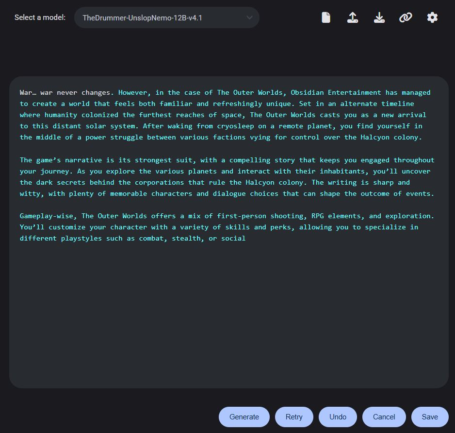

# AI Writing Notebook UI WEB Version

## Description
A WEB version of my GUI-based AI writing assistant that supports text generation, session saving and loading, advanced options toggling, and soon voice generation for the generated text (still in development).

## Table of Contents
- [Description](#description)
- [Features](#features)
- [Installation and Usage](#installation-and-usage)
  - [Starting the Application](#starting-the-application)
  - [Using the Application](#using-the-application)
- [What preset I choose?](#what-preset-i-choose)
    - [Preset Selection Guide](#preset-selection-guide)
    - [Additional Tips for Choosing a Preset](#additional-tips-for-choosing-a-preset)
- [Configuration](#configuration)
  - [Session Management](#session-management)
  - [Advanced Options](#advanced-options)
  - [Voice Generation](#voice-generation)
- [Requirements](#requirements)
- [Contributing](#contributing)
- [License](#license)

## Features
- **Text Generation:** Generates text based on the provided prompt using AI models.
- **Session Management:** Saves and loads the current session to resume writing from where you left off.
- **Advanced Options:** Provides additional settings that can be toggled on or off for more nuanced control over the text generation process.
- **Voice Generation:** Converts the generated text into speech for auditory feedback. (Coming soon)
- **Accessibility:** Generated text is highlighted for easy identification.

## Installation and Usage
### Starting the Application
- For the web version you can just paste the `Notebook-UI.html` file in your browser and start using the application, the api url and key fields are now embedded in the html file, just click on the api chain icon to open the API related settings and setup your api key and url, if you are a infermatic user, the base url is `https://api.totalgpt.ai`.

### Using the Application
- Write your initial prompt in the text area and click "Generate" to start the text generation process.
- Save your session by clicking the "Save" button, the app also auto saves after every generation.
- Load your session by simply reopening the page, the app also has a export and import buttons for saving and loading sessions stories for later use.

## **What Preset Should I Choose?**
------------------------------------
| **Preset** | **Description** | **Best For** | **Key Characteristics** |
| --- | --- | --- | --- |
| **Default** | Balanced creativity and coherence for general use. | **Most Tasks**, **Beginners** | Medium Temperature, Balanced Parameters |
| **NovelAI-Best Guess** | Tamed version of Default, more predictable. | **Consistency-Driven Tasks** | Higher Consistency, Lower Creativity |
| **NovelAI-Storywriter** | Coherent, focused, and less repetitive for storytelling. | **Storytelling**, **Structured Content** | Smaller Token Pool, Low Temperature, High Repetition Penalty |
| **MagnumHotLane & Texy_norep** | Balanced randomness for diverse responses. | **Tasks Requiring Variance**, **Intermediate Users** | Medium-High Temperature, Lower min_p for Texy |
| **Nexus Stable Event** | Stable, coherent outputs similar to Storywriter. | **Consistent, Structured Writing** | Similar to Storywriter, but Less Effective |

### **Preset Selection Guide**
-----------------------------

* **Need a starting point?** → **Default**
* **Want something more predictable?** → **NovelAI-Best Guess** or **NovelAI-Storywriter**
* **Writing a story?** → **NovelAI-Storywriter**
* **Need a balanced randomness?** → **MagnumHotLane & Texy_norep**

### **Additional Tips for Choosing a Preset**

* **Beginners**: Start with **Default**, but consider **NovelAI-Storywriter** when things start to get repetitive.
* **Consistency**: **NovelAI-Best Guess** and **NovelAI-Storywriter** are your best bets.
* **Creativity**: **Texy_norep** and **Universal Light** are the most creative presets.

## Configuration
There are two main configuration windows, the chain icon for the API settings and the gear icon for the advanced settings, there you can also create and edit presets just like the desktop version.

### Session Management
- The application automatically saves your session when you click generate and retry, if unsure, click the save button at the bottom right corner for a manual save.

### Advanced Options
- Toggle the advanced options to adjust parameters like temperature, top_k, presence_penalty, min_p, and top_p, etc. for more control over the text generation.

### Voice Generation
- TODO

## Requirements
- None, but may have a few UI bugs or weirdness as I am still working on making more mobile friendly.

## Contributing
Contributions are welcome! If you find any issues or have suggestions for improvements, please open an issue or submit a pull request.

## License
This project is licensed under the MIT License - see the LICENSE file for details.